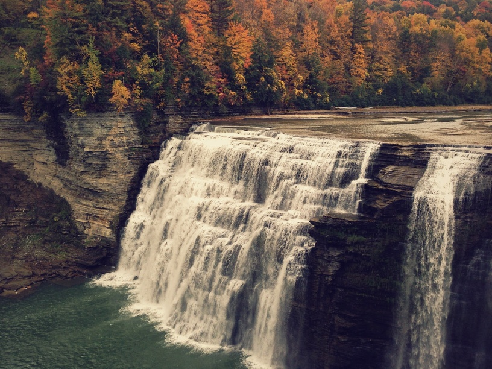

 Pixel sorting is an interesting, glitchy effect which selectively orders the pixels in the rows/columns of an image. It was popularized (possibly invented) by artist [Kim Asendorf](http://kimasendorf.com/) (processing source code [here](https://github.com/kimasendorf/ASDFPixelSort)). The processing script was cryptic and not very hackable, and I felt like something more lightweight was needed, so I wrote my own version in python – more info on [GitHub](https://github.com/satyarth/pixelsort/).The earliest reference  to pixel sorting I could find on the internet is [this paper](www.isprs.org/proceedings/XXVII/congress/part3/31_XXVII-part3.pdf) (PDF) by scientists from Iraq's Scientific Research Council. They propose using it as a technique for unsupervised classification, to be applied to images from remote sensing satellites. Neat!

Here's what it looks like in action:

*The original image*, via [pexels](https://www.pexels.com/photo/water-waterfall-forest-woods-24222/)

## How does it work?

There are two steps involved:

* The rows/columns of the image are split into 'intervals' (more on this later).
* The pixels in each interval are rearranged so as to sort them with respect to some property, say, lightness.

Kim Asendorf's code simply applies this technique twice: first vertically, then horizontally.

The intervals are defined by regions of the image that are too light or too dark – the edges of these regions define the edges of the intervals.

For example, consider:

* The top left is the original image.
* The top right is the image with pixels outside the lightness threshold replaced with black, and the rest filled in with white. Notice that the foam – too light – and the shadows – too dark – are outside the threshold. *(Yes, I just discovered en-dashes. Deal with it.)*
* On the bottom left is the image with the intervals filled in with random colors – each color represents a different interval.
* On the bottom left is the image with sorted intervals.

## How can I pixelsort?

All the images in this article were generated using a pixel sorting script I wrote in python – [source here](https://github.com/satyarth/pixelsort/). It shouldn't be too hard to use, details are in `REAMDE.md`. If you do anything with it I'd love to see it!

**Edit:** The script was used to make [this](https://www.youtube.com/watch?v=bV2Br6e_bd8) music video. Check it out!