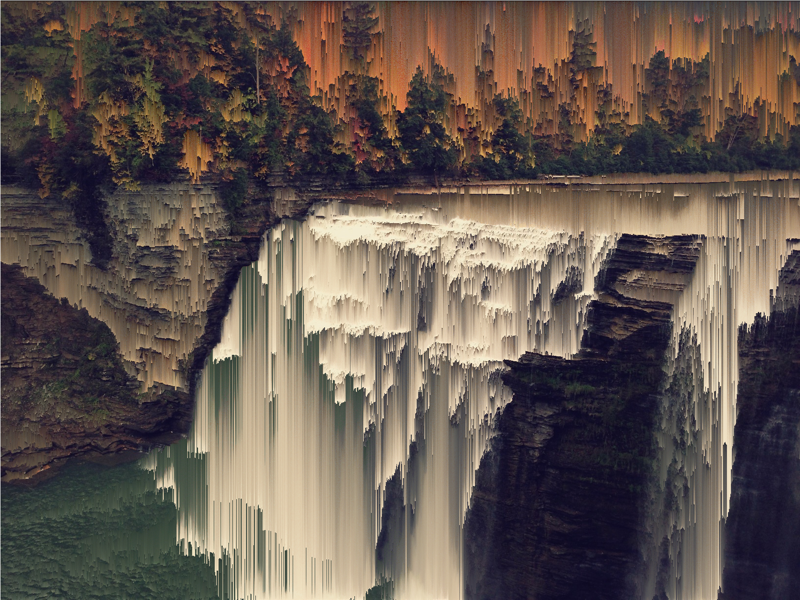
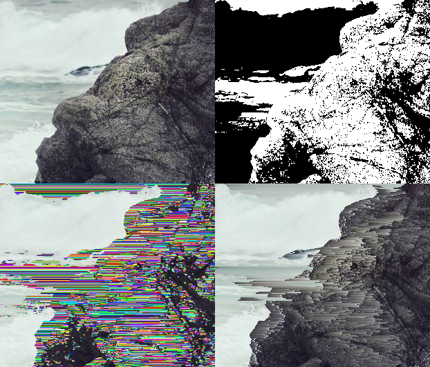

I wrote my own pixel sorter ([source here](https://github.com/satyarth/pixelsort/)) after I stumbled upon [/r/pixelsorting/](http://www.reddit.com/r/pixelsorting/). *Pixel sorting* is a technique that can mangle images to create stuff like:

Higher resolutions of these and more at this [imgur gallery](http://imgur.com/a/nZHbb).

## How exactly do you sort pixels?

It's simple enough to sort numbers, but how do we extend this to pixels? Well, it's more of an art than a science. Roughly speaking, you need to choose two things:

**1. A function with respect to which to sort the pixels.**

Consider the image below. Let's say we want to sort each entire row separately. What numerical quantities would it make sense to max/minimize?

* Intensity (R+G+B)

Here we're sorting with respect to the R+G+B values. Notice that the brightest parts of the image shift right while the darker parts migrate left.

* Other combinations of RGB (R+G-B)

The bluish parts of the image migrate left while the reddish/greenish parts migrate right.

* Arbitrary functions of RGB

Absolute value of difference between R and B

**2. A way to split up the rows (or columns) of the image into intervals that make sense to sort.**

Sure, we could just sort *all* the pixels along each row. For example, the same image:

turns into:

...but that isn't very interesting. So how do we choose these intervals? A very simple way which gives reasonably good results is to generate intervals of random widths:

Note that even though the intervals are sorted from dark to bright, the overall structure of the original image is maintained. Another way to define the intervals is based on the edges in the image. Running an edge detection and thresholding gives us:

Every black pixel represents a boundary between two intervals. Sorting according to these intervals gives:

We can define the intervals less randomly to get:

It is, of course, possible to define the intervals manually but the result heavily depends on your definition.

All the images in this article were generated using a pixel sorting script I wrote in python- [source here](https://github.com/satyarth/pixelsort/). It shouldn't be too hard to use, if you do anything with it I'd love to see it!

*Edit:* The script was used to make [this](https://www.youtube.com/watch?v=bV2Br6e_bd8) music video. Check it out!